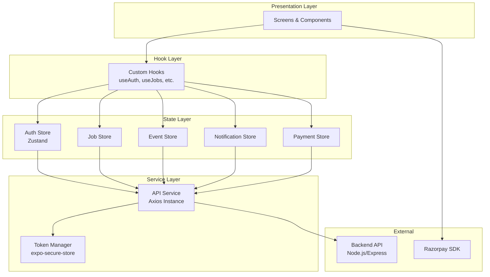
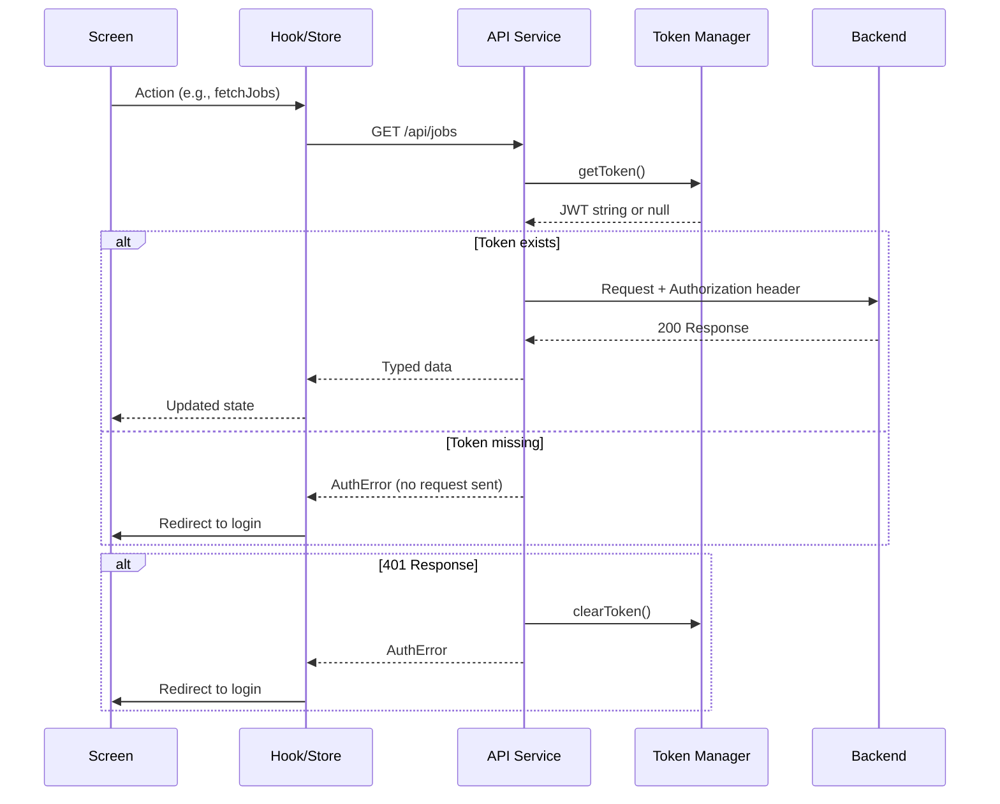
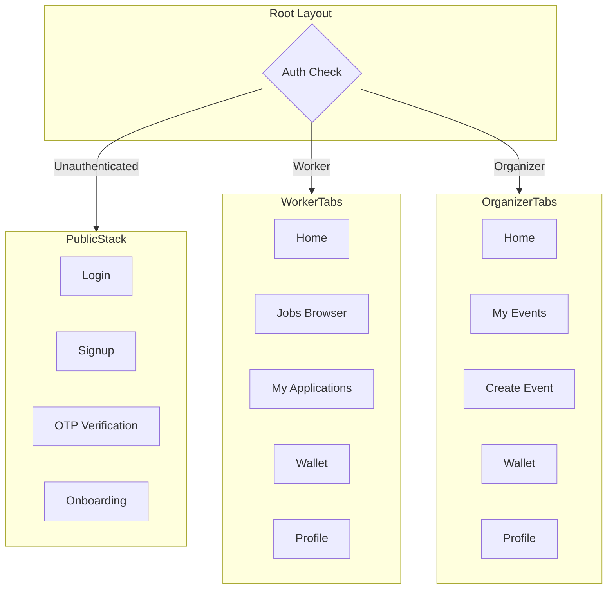

# Design Document: Frontend API Integration

## Overview

This design transforms the DOLX React Native/Expo app from a static UI prototype into a fully functional event staffing platform by introducing a centralized API service layer, global auth state management via Zustand, and connecting all existing and new screens to the Node.js/Express/MongoDB backend.

The architecture follows a layered approach:
1. **API Layer** — A typed Axios-based HTTP client with token injection and error normalization
2. **State Layer** — Zustand stores for auth, jobs, events, notifications, and payments
3. **Screen Layer** — React Native screens consuming stores and API services via custom hooks

All backend APIs are already built and stable. The frontend work is purely additive — no backend changes required.

### Key Design Decisions

| Decision | Choice | Rationale |
|----------|--------|-----------|
| State management | Zustand | Lightweight, no boilerplate, works well with React Native, supports persistence |
| HTTP client | Axios | Interceptors for token injection/401 handling, timeout config, TypeScript support |
| Secure storage | expo-secure-store | Expo SDK 56 native secure storage, no native module linking required |
| Form validation | Inline (no library) | Requirements are simple enough; avoids extra dependency for phone/email validation |
| Pagination | Cursor-based via page param | Matches backend's skip/limit pagination pattern |

## Architecture



### Request Flow



### Navigation Architecture



## Components and Interfaces

### API Service (`src/services/api.ts`)

```typescript
interface ApiError {
  code: string;           // e.g., 'AUTH_MISSING', 'NETWORK_ERROR', 'VALIDATION_ERROR'
  message: string;        // User-facing message
  url?: string;           // Original request URL
  status?: number;        // HTTP status code
  fieldErrors?: Record<string, string>; // Field-specific validation errors
}

interface ApiResponse<T> {
  success: true;
  data: T;
  meta?: { total: number; page: number; limit: number };
}

interface ApiService {
  get<T>(path: string, params?: Record<string, string>): Promise<ApiResponse<T> | ApiError>;
  post<T>(path: string, body?: unknown): Promise<ApiResponse<T> | ApiError>;
  put<T>(path: string, body?: unknown): Promise<ApiResponse<T> | ApiError>;
  delete<T>(path: string, params?: Record<string, string>): Promise<ApiResponse<T> | ApiError>;
  upload<T>(path: string, formData: FormData): Promise<ApiResponse<T> | ApiError>;
}
```

### Token Manager (`src/services/tokenManager.ts`)

```typescript
interface TokenManager {
  getToken(): Promise<string | null>;
  setToken(token: string): Promise<void>;
  clearToken(): Promise<void>;
}
```

### Auth Store (`src/stores/authStore.ts`)

```typescript
interface User {
  _id: string;
  name: string;
  email: string;
  phone: string;
  role: 'worker' | 'organizer' | 'admin';
  workerProfile?: WorkerProfile;
  organizerProfile?: OrganizerProfile;
}

interface AuthState {
  user: User | null;
  isAuthenticated: boolean;
  isLoading: boolean;       // true during session restore
  login(email: string, password: string): Promise<ApiError | null>;
  register(data: RegisterData): Promise<ApiError | null>;
  logout(): Promise<void>;
  restoreSession(): Promise<void>;
  updateProfile(data: Partial<User>): void;
}
```

### Job Store (`src/stores/jobStore.ts`)

```typescript
interface JobState {
  jobs: Job[];
  currentJob: Job | null;
  page: number;
  hasMore: boolean;
  isLoading: boolean;
  error: string | null;
  filters: { role?: string; city?: string; eventType?: string };
  fetchJobs(reset?: boolean): Promise<void>;
  fetchJobById(id: string): Promise<void>;
  setFilter(key: string, value: string | undefined): void;
  clearFilters(): void;
}
```

### Event Store (`src/stores/eventStore.ts`)

```typescript
interface EventState {
  events: Event[];
  currentEvent: EventDetail | null;
  isLoading: boolean;
  error: string | null;
  createEvent(data: CreateEventData): Promise<string | ApiError>;
  fetchMyEvents(): Promise<void>;
  fetchEventById(id: string): Promise<void>;
  completeEvent(id: string): Promise<ApiError | null>;
}
```

### Notification Store (`src/stores/notificationStore.ts`)

```typescript
interface NotificationState {
  notifications: Notification[];
  unreadCount: number;
  page: number;
  hasMore: boolean;
  isLoading: boolean;
  fetchNotifications(reset?: boolean): Promise<void>;
  markAsRead(id: string): Promise<void>;
  markAllAsRead(): Promise<void>;
}
```

### Payment Store (`src/stores/paymentStore.ts`)

```typescript
interface PaymentState {
  transactions: Payment[];
  isLoading: boolean;
  error: string | null;
  fetchTransactions(): Promise<void>;
  fundEscrow(paymentId: string): Promise<RazorpayOrder | ApiError>;
  confirmEscrow(paymentId: string, razorpayData: RazorpayCallback): Promise<ApiError | null>;
  releasePayment(paymentId: string): Promise<ApiError | null>;
}
```

### Key Screen Components

| Screen | Route | Role | Primary API Endpoints |
|--------|-------|------|----------------------|
| Job Browser | `/(tabs)/jobs` | Worker | GET /api/jobs |
| Job Detail | `/job/[id]` | Worker | GET /api/jobs/:id |
| My Applications | `/(tabs)/applications` | Worker | GET /api/workers/applications |
| Event Creation | `/event/create` | Organizer | POST /api/events, POST /api/events/:id/jobs |
| Applicant Manager | `/event/[eventId]/job/[jobId]/applicants` | Organizer | GET /api/jobs/:id/applicants |
| Notification Center | `/notifications` | Both | GET /api/notifications |
| Review Screen | `/reviews` | Both | GET /api/reviews/workers/:id, POST /api/reviews |
| Payment Flow | `/payment/[id]` | Organizer | POST /api/payments/:id/fund, POST /api/payments/:id/confirm |

## Data Models

### Shared Types (`src/types/index.ts`)

```typescript
// ─── Enums (matching backend constants) ───
type UserRole = 'worker' | 'organizer' | 'admin';
type JobRole = 'Event Helper' | 'Setup / Decoration Crew' | 'Catering Staff' | 'Photographer' | 'Videographer' | 'Brand Promoter' | 'Registration Staff' | 'Host / Anchor' | 'Security Staff' | 'Crowd Management';
type EventCategory = 'Wedding' | 'Corporate / Conference' | 'Concert / Music' | 'Exhibition / Trade Show' | 'Festival' | 'Sports Event' | 'Private Party' | 'Other';
type EventStatus = 'draft' | 'active' | 'completed' | 'cancelled';
type JobStatus = 'open' | 'closed' | 'completed' | 'cancelled';
type ApplicationStatus = 'pending' | 'accepted' | 'rejected' | 'cancelled';
type WorkStatus = 'assigned' | 'ongoing' | 'completed' | 'no_show';
type PaymentStatus = 'pending' | 'held' | 'released' | 'refunded' | 'failed';
type PayType = 'fixed' | 'hourly';

// ─── Core Models ───
interface User {
  _id: string;
  name: string;
  email: string;
  phone: string;
  role: UserRole;
  isActive: boolean;
  workerProfile?: {
    skills: JobRole[];
    experienceLevel: 'Beginner' | 'Intermediate' | 'Expert';
    location: { city?: string; state?: string };
    ratingAvg: number;
    ratingCount: number;
    totalEarnings: number;
    profilePhoto?: string;
  };
  organizerProfile?: {
    companyName?: string;
    ratingAvg: number;
    ratingCount: number;
  };
}

interface Job {
  _id: string;
  event: Event | string;
  organizer: Pick<User, '_id' | 'name' | 'organizerProfile'> | string;
  role: JobRole;
  numberOfWorkers: number;
  filledCount: number;
  payRate: number;
  payType: PayType;
  shiftStart: string;  // ISO datetime
  shiftEnd: string;
  status: JobStatus;
  createdAt: string;
}

interface Event {
  _id: string;
  organizer: string;
  title: string;
  eventType: EventCategory;
  description?: string;
  date: string;
  startTime?: string;
  endTime?: string;
  location: { address?: string; city: string; state?: string; pincode?: string };
  status: EventStatus;
  createdAt: string;
}

interface Application {
  _id: string;
  job: Job | string;
  event: Event | string;
  worker: User | string;
  organizer: string;
  status: ApplicationStatus;
  workStatus?: WorkStatus;
  createdAt: string;
  respondedAt?: string;
  completedAt?: string;
}

interface Payment {
  _id: string;
  application: string;
  job: { _id: string; role: string } | string;
  event: { _id: string; title: string } | string;
  organizer: string;
  worker: string;
  amount: number;
  commissionPercent: number;
  commissionAmount: number;
  workerPayout: number;
  status: PaymentStatus;
  gatewayOrderId?: string;
  gatewayPaymentId?: string;
  createdAt: string;
  escrowHeldAt?: string;
  releasedAt?: string;
}

interface Notification {
  _id: string;
  recipient: string;
  type: string;
  title: string;
  message: string;
  data?: Record<string, unknown>;
  isRead: boolean;
  createdAt: string;
}

interface Review {
  _id: string;
  job: { _id: string; role: string };
  fromUser: { _id: string; name: string; organizerProfile?: { companyName?: string } };
  toUser: string;
  rating: number;
  comment?: string;
  createdAt: string;
}

// ─── Request/Response Shapes ───
interface LoginRequest { email: string; password: string; }
interface RegisterRequest { name: string; email: string; phone: string; password: string; role: UserRole; companyName?: string; }
interface CreateEventRequest { title: string; eventType: EventCategory; description?: string; date: string; startTime?: string; endTime?: string; location: { address?: string; city: string; state?: string; pincode?: string }; }
interface CreateJobRequest { role: JobRole; numberOfWorkers: number; payRate: number; payType: PayType; shiftStart: string; shiftEnd: string; }
interface CreateReviewRequest { applicationId: string; rating: number; comment?: string; }

interface RazorpayOrder { orderId: string; amount: number; currency: string; keyId: string; paymentId: string; }
interface RazorpayCallback { razorpayOrderId: string; razorpayPaymentId: string; razorpaySignature: string; }

// ─── Pagination ───
interface PaginatedResponse<T> { data: T[]; meta: { total: number; page: number; limit: number }; }
```

### File Structure

```
src/
├── services/
│   ├── api.ts              # Axios instance with interceptors
│   └── tokenManager.ts     # expo-secure-store wrapper
├── stores/
│   ├── authStore.ts        # Zustand auth store
│   ├── jobStore.ts         # Job browsing state
│   ├── eventStore.ts       # Event management state
│   ├── notificationStore.ts # Notifications state
│   └── paymentStore.ts     # Payment/wallet state
├── types/
│   └── index.ts            # All TypeScript interfaces
├── hooks/
│   ├── useAuth.ts          # Auth convenience hook
│   ├── useDebounce.ts      # Debounce for search
│   └── useInfiniteScroll.ts # Pagination trigger hook
├── app/
│   ├── _layout.tsx         # Root layout with auth guard
│   ├── (auth)/             # Public auth screens
│   │   ├── login.tsx
│   │   ├── signup.tsx
│   │   └── verify.tsx
│   ├── (worker)/           # Worker tab group
│   │   ├── _layout.tsx
│   │   ├── home.tsx
│   │   ├── jobs.tsx
│   │   ├── applications.tsx
│   │   ├── wallet.tsx
│   │   └── profile.tsx
│   ├── (organizer)/        # Organizer tab group
│   │   ├── _layout.tsx
│   │   ├── home.tsx
│   │   ├── events.tsx
│   │   ├── create-event.tsx
│   │   ├── wallet.tsx
│   │   └── profile.tsx
│   ├── job/
│   │   └── [id].tsx        # Job detail screen
│   ├── event/
│   │   ├── [id].tsx        # Event detail
│   │   └── [eventId]/job/[jobId]/applicants.tsx
│   ├── notifications.tsx
│   ├── reviews.tsx
│   └── payment/
│       └── [id].tsx        # Payment flow
└── constants/
    └── theme.ts            # Existing theme file
```


## Correctness Properties

*A property is a characteristic or behavior that should hold true across all valid executions of a system — essentially, a formal statement about what the system should do. Properties serve as the bridge between human-readable specifications and machine-verifiable correctness guarantees.*

### Property 1: Token attachment on authenticated requests

*For any* API request made while a valid token exists in secure storage, the outgoing HTTP request SHALL contain an `Authorization` header with value `Bearer {token}` where `{token}` matches the stored token exactly.

**Validates: Requirements 1.1**

### Property 2: Unauthenticated request rejection

*For any* API request initiated when no token exists in secure storage, the API service SHALL reject the request locally (without sending an HTTP request) and return an error object with code `AUTH_MISSING`.

**Validates: Requirements 1.2**

### Property 3: Token clearance on 401 response

*For any* API request that receives an HTTP 401 response from the backend, the API service SHALL clear the token from secure storage and the resulting error SHALL have the token cleared (verifiable by subsequent getToken() returning null).

**Validates: Requirements 1.3**

### Property 4: Network error normalization

*For any* API request that fails due to network error or timeout, the returned error object SHALL contain a non-empty `code` string, a non-empty `message` string, and the original request URL string.

**Validates: Requirements 1.4**

### Property 5: Auth state round-trip persistence

*For any* valid user profile object and JWT token string returned from a login response, after the auth store processes the login, calling `getToken()` SHALL return the same token and the store's user state SHALL contain the same profile data (name, email, phone, role).

**Validates: Requirements 2.1**

### Property 6: Login form empty-field validation

*For any* login submission where the phone field is empty or whitespace-only, OR the password field is empty or whitespace-only, the form SHALL produce a validation error without invoking the API service.

**Validates: Requirements 3.7**

### Property 7: Registration form input validation

*For any* registration submission where any required field (name, email, phone, password, role) is empty, OR the phone number does not contain exactly 10 digits, the form SHALL produce a field-specific validation error without invoking the API service.

**Validates: Requirements 3.8**

### Property 8: Infinite scroll pagination appends without duplicates

*For any* sequence of paginated job list fetches where page N returns items, fetching page N+1 SHALL append results to the existing list such that the combined list contains no duplicate job IDs.

**Validates: Requirements 5.2**

### Property 9: Client-side search filter correctness

*For any* loaded job list and any non-empty search string, the filtered results SHALL only contain jobs whose role name or event name includes the search string (case-insensitive comparison). Furthermore, if the search string is empty, all loaded jobs SHALL be displayed.

**Validates: Requirements 5.4**

### Property 10: Apply button state determinism

*For any* job with a given status, filledCount, numberOfWorkers, and user application status (applied/not applied), the Apply button SHALL be: (a) visible and enabled when status="open" AND filledCount < numberOfWorkers AND user has not applied; (b) visible but disabled with "Applied" label when user has applied; (c) replaced by "Positions Filled" when filledCount >= numberOfWorkers.

**Validates: Requirements 6.4, 6.5, 6.6**

### Property 11: Transaction amount INR formatting

*For any* payment object with a numeric amount, the rendered transaction display SHALL contain the amount formatted with the ₹ symbol, the numeric amount value, the date, and an associated event or job name string.

**Validates: Requirements 10.9**

### Property 12: Photo upload client-side validation

*For any* selected file, if its size exceeds 5,242,880 bytes (5 MB) OR its MIME type is not `image/jpeg` or `image/png`, the upload SHALL be rejected locally with an error message and no network request SHALL be made.

**Validates: Requirements 13.7**

### Property 13: Complete Event button conditional visibility

*For any* event detail view, the "Complete Event" button SHALL be visible only when the event status is "active" AND every attached job has filledCount equal to numberOfWorkers.

**Validates: Requirements 14.3**

### Property 14: Role-based tab configuration

*For any* authenticated user, the tab navigation SHALL display exactly: [Home, Jobs, My Applications, Wallet, Profile] when role is "worker", or [Home, My Events, Create Event, Wallet, Profile] when role is "organizer". No other tabs SHALL be shown.

**Validates: Requirements 15.1, 15.2**

### Property 15: Auth guard protection

*For any* navigation attempt to a protected screen by an unauthenticated user (no valid token/session), the app SHALL redirect to the login screen without rendering the protected screen content.

**Validates: Requirements 15.3**

### Property 16: Role guard protection

*For any* navigation attempt by an authenticated user to a screen not assigned to their role, the app SHALL redirect to the user's role-appropriate Home tab without rendering the unauthorized screen content.

**Validates: Requirements 15.4**

## Error Handling

### Error Classification

| Error Type | Code | User Message | Action |
|-----------|------|--------------|--------|
| Missing token | `AUTH_MISSING` | "Please log in to continue" | Redirect to login |
| Expired/invalid token | `AUTH_EXPIRED` | "Session expired, please log in again" | Clear token, redirect to login |
| Network failure | `NETWORK_ERROR` | "Unable to connect. Check your internet and try again." | Show retry button |
| Timeout (30s) | `TIMEOUT_ERROR` | "Request timed out. Please try again." | Show retry button |
| Validation error | `VALIDATION_ERROR` | Backend-provided field messages | Show inline field errors |
| Server error (5xx) | `SERVER_ERROR` | "Something went wrong. Please try again later." | Show retry button |
| Conflict (409) | `CONFLICT` | Backend-provided message (e.g., "Already applied") | Show inline message |
| Forbidden (403) | `FORBIDDEN` | "You don't have access to this resource" | Navigate back |
| Not found (404) | `NOT_FOUND` | "The requested resource was not found" | Navigate back |

### Error Handling Strategy

1. **API Interceptor Level**: The Axios response interceptor normalizes all errors into the `ApiError` interface. Non-2xx responses are caught, parsed, and returned as structured error objects rather than thrown exceptions.

2. **Store Level**: Each store action returns `ApiError | null`. Screens check the return value and display appropriate UI feedback. Stores never throw — they communicate errors through return values and state.

3. **Screen Level**: Each screen handles three states: loading, success, and error. Error states always include a user-facing message and, where appropriate, a retry action.

4. **Global 401 Handling**: The API interceptor detects 401 responses, clears the token, and sets the auth store to unauthenticated. The root layout's auth check will then redirect to login.

5. **Optimistic Updates**: For accept/reject applicant actions, the UI updates optimistically and reverts on failure. For all other mutations (create event, apply to job, etc.), the UI waits for server confirmation before updating.

### Retry Strategy

- All GET requests that fail show a retry button
- Retry uses the same parameters as the original request
- No automatic retry / exponential backoff (to keep the UX simple and avoid unexpected charges)
- Retry resets the loading state (shows loading indicator again)

### Offline Behavior

- The app does not implement offline-first capabilities in this iteration
- When offline, the API service returns `NETWORK_ERROR` immediately
- No request queuing or local persistence of mutations

## Testing Strategy

### Testing Approach

This feature uses a **dual testing approach**:
- **Property-based tests** for universal invariants (API service behavior, validation logic, state transitions, navigation guards)
- **Example-based unit tests** for specific UI interactions, loading states, and integration flows

### Property-Based Testing

**Library**: [fast-check](https://github.com/dubzzz/fast-check) (TypeScript-native, works with Jest/Vitest)

**Configuration**:
- Minimum 100 iterations per property test
- Each test tagged with design property reference
- Tag format: `Feature: frontend-api-integration, Property {N}: {title}`

**Properties to implement** (from Correctness Properties section):
1. Token attachment (mock Axios, generate random tokens + paths)
2. Unauthenticated rejection (generate random paths, verify no HTTP call)
3. 401 token clearance (mock 401 responses for random paths)
4. Network error normalization (mock timeouts/network errors)
5. Auth state round-trip (generate random user profiles)
6. Login validation (generate invalid phone/password combinations)
7. Registration validation (generate invalid field combinations)
8. Pagination append uniqueness (generate overlapping page results)
9. Search filter correctness (generate job lists + search strings)
10. Apply button state logic (generate all state combinations)
11. Transaction INR formatting (generate random amounts)
12. Photo validation (generate random file sizes/types)
13. Complete Event button logic (generate event/job state combinations)
14. Role-based tabs (generate users with different roles)
15. Auth guard (generate protected routes + unauthenticated state)
16. Role guard (generate role/route mismatches)

### Example-Based Unit Tests

**Framework**: Jest with React Native Testing Library

**Coverage areas**:
- Screen mounting and initial data fetch
- Loading/skeleton states
- Error states with retry
- Empty states
- Form submission flows
- Navigation between screens
- Razorpay integration callbacks

### Integration Tests

**Scope**: End-to-end flows testing screen → store → API → mock server:
- Login flow (form → API → auth store → navigation)
- Job application flow (browse → detail → apply → confirmation)
- Event creation flow (form → create → add jobs → done)
- Payment flow (fund → Razorpay → confirm → release)

### Test File Structure

```
__tests__/
├── properties/
│   ├── apiService.property.test.ts
│   ├── authValidation.property.test.ts
│   ├── jobBrowser.property.test.ts
│   ├── navigation.property.test.ts
│   ├── paymentFormat.property.test.ts
│   └── photoValidation.property.test.ts
├── unit/
│   ├── stores/
│   │   ├── authStore.test.ts
│   │   ├── jobStore.test.ts
│   │   ├── eventStore.test.ts
│   │   └── paymentStore.test.ts
│   └── screens/
│       ├── login.test.tsx
│       ├── jobBrowser.test.tsx
│       ├── jobDetail.test.tsx
│       └── ...
└── integration/
    ├── loginFlow.test.ts
    ├── applicationFlow.test.ts
    └── paymentFlow.test.ts
```

### Dependencies to Add

```json
{
  "dependencies": {
    "axios": "^1.7.0",
    "zustand": "^5.0.0",
    "expo-secure-store": "~14.0.0",
    "react-native-razorpay": "^2.3.0"
  },
  "devDependencies": {
    "jest": "^29.7.0",
    "@testing-library/react-native": "^12.0.0",
    "fast-check": "^3.19.0",
    "msw": "^2.3.0",
    "@types/jest": "^29.5.0"
  }
}
```
